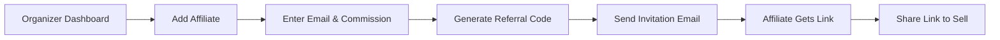
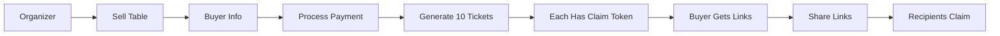
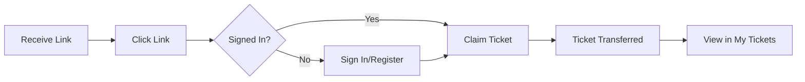

# SteppersLife Ticket Distribution & Affiliate System
## BMad Method Documentation

### System Overview
This document describes the complete ticket sales, distribution, and affiliate commission system for SteppersLife.

## 🎯 Core Business Rules

### 1. User Roles & Permissions

| Role | Can Sell Tickets | Can Sell Tables | Earn Commission | Can Transfer |
|------|-----------------|-----------------|-----------------|--------------|
| Event Organizer | ✅ Individual | ✅ Bulk (Tables) | No | ✅ |
| Affiliate | ✅ Individual | ❌ | ✅ Fixed $ per ticket | ❌ |
| Table Buyer | ❌ | ❌ | ❌ | ✅ Share only |
| Ticket Recipient | ❌ | ❌ | ❌ | ❌ |

### 2. Sales Channels

#### Individual Ticket Sales
- **Direct**: Organizer sells directly
- **Affiliate**: Friends sell with referral code
- **Commission**: Fixed dollar amount per ticket (e.g., $5)

#### Table Sales (Bulk Tickets)
- **Who**: ONLY event organizer
- **What**: Group of tickets (e.g., 10 seats)
- **Distribution**: Buyer can share tickets via claim links
- **No Resale**: Recipients cannot resell

## 📊 Database Schema

### Enhanced Tickets Table
```typescript
tickets: {
  // Core fields
  eventId: Id<"events">
  userId: string                     // Current owner
  status: "valid" | "used" | "refunded" | "cancelled"
  
  // Ownership tracking
  currentOwner?: string              // Who has it now
  originalPurchaser?: string         // Who bought it
  claimToken?: string                // Unique claim link token
  isClaimable?: boolean              // Can be transferred
  claimedAt?: number                 // When claimed
  
  // Group purchase (tables)
  groupPurchaseId?: string           // Links table tickets
  groupType?: "table" | "individual"
  tableName?: string                 // "VIP Table 1"
  seatNumber?: string                // "Seat 5"
  
  // Affiliate tracking
  referralCode?: string              // Affiliate's code
  affiliateCommission?: number       // Commission amount
}
```

### Ticket Claims Table
```typescript
ticketClaims: {
  ticketId: Id<"tickets">
  claimToken: string
  fromUser: string                   // Who shared it
  toUser?: string                    // Who claimed it
  status: "active" | "claimed" | "expired"
  createdAt: number
  claimedAt?: number
  expiresAt: number                  // 30 days
}
```

### Affiliate Programs Table
```typescript
affiliatePrograms: {
  eventId: Id<"events">
  affiliateUserId: string
  affiliateEmail: string
  affiliateName: string
  referralCode: string               // "JOHN-SUMMER25"
  commissionPerTicket: number        // Fixed $5
  totalSold: number
  totalEarned: number
  isActive: boolean
  createdBy: string                  // Organizer ID
}
```

## 🔄 User Flows

### Flow 1: Setting Up Affiliates


### Flow 2: Table Purchase & Distribution


### Flow 3: Claiming a Ticket


## 💻 Implementation Components

### 1. Claim Token Generation
```typescript
function generateClaimToken(): string {
  const chars = 'ABCDEFGHIJKLMNOPQRSTUVWXYZ0123456789';
  let token = '';
  for (let i = 0; i < 12; i++) {
    token += chars[Math.floor(Math.random() * chars.length)];
  }
  return token;
}
```

### 2. Referral Link Structure
```
https://stepperslife.com/events/[eventId]?ref=[referralCode]

Example:
https://stepperslife.com/events/abc123?ref=JOHN-SUMMER25
```

### 3. Claim Link Structure
```
https://stepperslife.com/claim/[claimToken]

Example:
https://stepperslife.com/claim/ABC123XYZ789
```

## 🔐 Security Rules

### Ticket Transfer Rules
- ✅ One transfer per ticket
- ✅ Must be signed in to claim
- ✅ Cannot claim own ticket
- ✅ Links expire after 30 days
- ✅ Full audit trail maintained

### Commission Rules
- ✅ Only organizer sets commission rates
- ✅ Fixed dollar amount (not percentage)
- ✅ Tracked per ticket sale
- ✅ Automatic calculation

### Table Sales Rules
- ✅ Only organizer can sell tables
- ✅ Bulk generation of linked tickets
- ✅ Each ticket individually claimable
- ✅ No resale after distribution

## 📱 User Interface Components

### 1. Affiliate Dashboard
- View personal referral link
- Track sales count
- See earnings
- Request payout

### 2. Table Distribution Dashboard
- List all table tickets
- Share individual links
- Track claim status
- See recipient info

### 3. Claim Page
- Simple claim button
- Sign in prompt if needed
- Success confirmation
- Redirect to tickets

## 📈 Analytics & Reporting

### Organizer Metrics
- Total tickets sold
- Affiliate performance
- Table sales tracking
- Distribution status

### Affiliate Metrics
- Clicks on referral link
- Conversion rate
- Total commission earned
- Pending payouts

## 🚀 Deployment Checklist

### Phase 1: Schema Updates ✅
- [x] Update tickets table
- [x] Create ticketClaims table
- [x] Create affiliatePrograms table

### Phase 2: Core Functions
- [ ] Ticket claim mutation
- [ ] Affiliate tracking
- [ ] Commission calculation
- [ ] Table bulk generation

### Phase 3: User Interface
- [ ] Share ticket component
- [ ] Claim page
- [ ] Affiliate dashboard
- [ ] Distribution dashboard

### Phase 4: Integration
- [ ] Update purchase flow
- [ ] Add to SyncUserWithConvex
- [ ] Email notifications
- [ ] Analytics tracking

## 🔧 Environment Variables

No new environment variables required. System uses existing:
- `NEXT_PUBLIC_CONVEX_URL`
- `NEXTAUTH_URL`
- Email service credentials

## 📝 Testing Scenarios

### Test Case 1: Affiliate Sales
1. Create affiliate program
2. Share referral link
3. Purchase with link
4. Verify commission tracked

### Test Case 2: Table Distribution
1. Organizer sells table
2. Buyer receives 10 tickets
3. Share 5 tickets
4. Recipients claim
5. Verify ownership transfer

### Test Case 3: Edge Cases
1. Expired claim links
2. Duplicate claims
3. Self-claims
4. Invalid tokens

## 🎯 Success Metrics

- **Adoption**: % of events using affiliates
- **Distribution**: Average time to distribute table tickets
- **Conversion**: Referral link click to purchase rate
- **User Growth**: New registrations from claims

## 📚 Related Documentation

- [PWA Implementation](./PWA_IMPLEMENTATION.md)
- [QR Scanner System](./QR_SCANNER_SYSTEM.md)
- [Payment Integration](./PAYMENT_INTEGRATION.md)

---

*Documentation follows BMad Method v3.0 standards*
*Last Updated: 2025-08-24*
*System Version: 1.0.0*