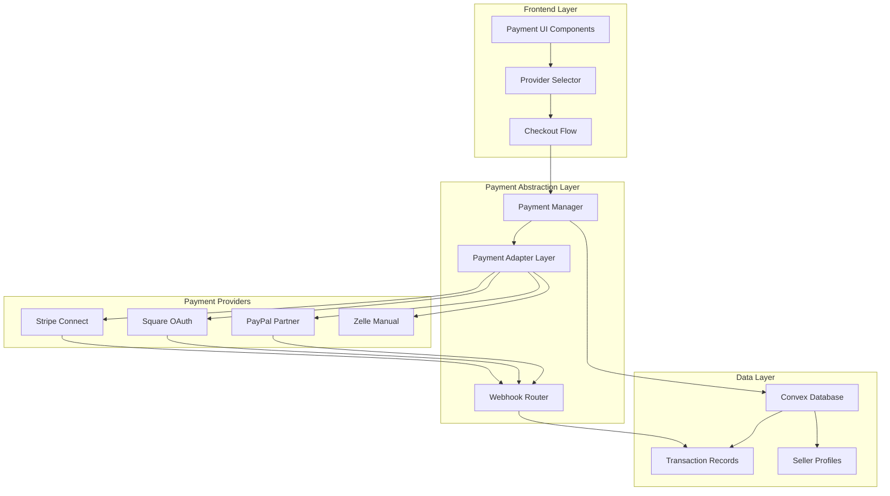
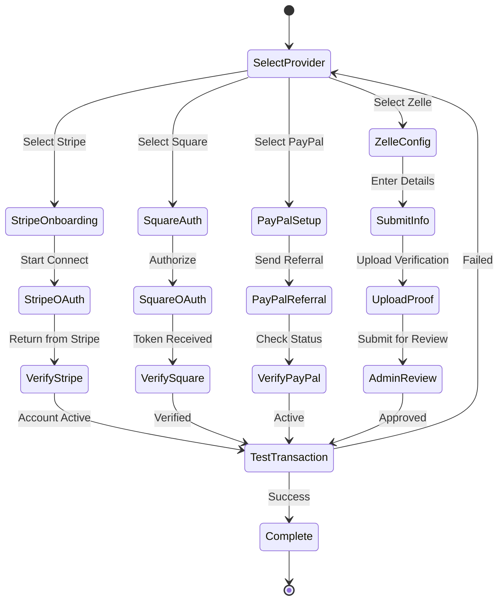

# SteppersLife Multi-Provider Payment Architecture

## Introduction

This document outlines the complete payment system architecture for SteppersLife, supporting multiple payment providers (Stripe, Square, PayPal, Zelle) with unified checkout flow, automatic split payments, and $1.50 per ticket platform fees. This architecture enables sellers to choose their preferred payment method while providing buyers with a seamless checkout experience.

### Change Log

| Date | Version | Description | Author |
|------|---------|-------------|--------|
| 2025-08-24 | 1.0.0 | Initial multi-provider payment architecture | Winston (Architect) |

## High Level Architecture

### Technical Summary

The payment architecture implements a provider-agnostic abstraction layer that routes transactions to the seller's chosen payment provider (Stripe Connect, Square OAuth, PayPal Partner, or Zelle manual processing). The system automatically handles split payments with a $1.50 per ticket platform fee, unified webhook processing, and comprehensive transaction tracking. Built on Next.js with Convex database, it integrates seamlessly with the existing simplified ticket system while maintaining PCI compliance through tokenized payments.

### Platform and Infrastructure

**Platform:** Vercel + Convex Cloud  
**Key Services:** 
- Stripe Connect API for express accounts
- Square OAuth + Payments API
- PayPal Partner Referral + Payouts API
- Manual Zelle verification workflow
- Convex for real-time data sync
- Next.js API routes for webhooks

**Deployment:** Production on Coolify (72.60.28.175)

### Architecture Diagram



### Architectural Patterns

- **Strategy Pattern:** Payment provider selection with common interface
- **Adapter Pattern:** Provider-specific implementations behind unified API
- **Repository Pattern:** Abstract payment data access through Convex
- **Webhook Aggregator:** Single endpoint with provider routing
- **Circuit Breaker:** Fallback payment methods on provider failure

## Payment Provider Specifications

### Provider Comparison Matrix

| Feature | Stripe Connect | Square (+ CashApp) | PayPal Partner | Zelle Manual |
|---------|---------------|--------------------|----------------|--------------|
| **Setup Complexity** | Medium | Low | Medium | Low |
| **Payment Methods** | Cards, Bank | Cards, CashApp | PayPal, Cards | Bank Transfer |
| **Split Payment** | Automatic | Manual transfer | Payouts API | Manual |
| **Platform Fee** | $1.50/ticket native | $1.50/ticket manual | $1.50/ticket Payouts | $1.50/ticket manual |
| **Settlement Time** | 2-7 days | 1-2 days | Instant-3 days | 3-5 days |
| **Transaction Fee** | 2.9% + 30¢ | 2.6% + 10¢ | 2.89% + 49¢ | 0% |
| **International** | Yes | Limited | Yes | No |
| **Refunds** | Automatic | Automatic | Automatic | Manual |

### Provider Implementation Details

#### 1. Stripe Connect (Express Accounts)

```typescript
interface StripeProviderConfig {
  type: 'stripe';
  accountId: string;        // Connected account ID
  accountStatus: 'pending' | 'active' | 'restricted';
  capabilities: {
    card_payments: boolean;
    transfers: boolean;
  };
  platformFeePerTicket: 1.50; // Platform takes $1.50 per ticket
}

// Key Implementation Points:
// - Express onboarding flow with OAuth
// - Automatic platform fee via application_fee_amount ($1.50 per ticket)
// - Destination charges for instant splits
// - Webhook: payment_intent.succeeded
```

#### 2. Square OAuth Integration (with CashApp)

```typescript
interface SquareProviderConfig {
  type: 'square';
  merchantId: string;
  locationId: string;
  accessToken: string;       // OAuth token
  refreshToken: string;
  acceptsCashApp: boolean;    // Enable CashApp payments
  platformFeePerTicket: 1.50;
}

// Key Implementation Points:
// - OAuth flow for seller authorization
// - Supports both card payments and CashApp
// - CashApp enabled automatically with Square account
// - Manual fee calculation and transfer
// - Use Square Transfers API for payouts
// - Webhook: payment.updated
```

#### 3. PayPal Partner Platform

```typescript
interface PayPalProviderConfig {
  type: 'paypal';
  merchantId: string;        // Partner merchant ID
  merchantEmail: string;
  referralStatus: 'pending' | 'active';
  payoutsEnabled: boolean;
  platformFeePerTicket: 1.50;
}

// Key Implementation Points:
// - Partner Referral API for onboarding
// - Payouts API for split payments
// - Calculate $1.50 per ticket fee before payout
// - Webhook: PAYMENT.CAPTURE.COMPLETED
```

#### 4. Zelle Manual Processing

```typescript
interface ZelleProviderConfig {
  type: 'zelle';
  email: string;
  phone?: string;
  verificationStatus: 'unverified' | 'pending' | 'verified';
  verificationProof?: string;  // Document ID
  manualProcessing: true;
  platformFeePerTicket: 1.50;
}

// Key Implementation Points:
// - Email/SMS notification to buyer
// - 3-day verification window
// - Manual admin approval workflow
// - $1.50 per ticket fee deducted from payout
```

## Unified Payment Interface

### Payment Adapter Layer

```typescript
// Base Payment Provider Interface
interface PaymentProvider {
  createCheckoutSession(params: CheckoutParams): Promise<CheckoutSession>;
  processWebhook(payload: WebhookPayload): Promise<ProcessedPayment>;
  refundPayment(paymentId: string, amount?: number): Promise<Refund>;
  getPaymentStatus(paymentId: string): Promise<PaymentStatus>;
  calculatePlatformFee(ticketCount: number): number;
}

// Checkout Parameters (provider-agnostic)
interface CheckoutParams {
  eventId: string;
  tickets: TicketSelection[];
  totalAmount: number;
  buyerEmail: string;
  sellerId: string;
  successUrl: string;
  cancelUrl: string;
  metadata: {
    referralCode?: string;
    tableId?: string;
    bundleId?: string;
  };
}

// Unified Checkout Response
interface CheckoutSession {
  provider: PaymentProvider;
  sessionId: string;
  checkoutUrl: string;
  expiresAt: Date;
  totalAmount: number;
  platformFee: number;
  sellerAmount: number;
}
```

### Payment Manager Service

```typescript
class PaymentManager {
  private providers: Map<string, PaymentProvider>;
  
  async createCheckout(sellerId: string, params: CheckoutParams) {
    // 1. Get seller's payment configuration
    const seller = await convex.query("users.get", { userId: sellerId });
    
    // 2. Check if payment method configured
    if (!seller.preferredPaymentMethod) {
      throw new Error("Seller must configure payment method");
    }
    
    // 3. Get appropriate provider
    const provider = this.providers.get(seller.preferredPaymentMethod);
    
    // 4. Create checkout session
    const session = await provider.createCheckoutSession({
      ...params,
      sellerConfig: seller.paymentConfig
    });
    
    // 5. Store transaction intent
    await convex.mutation("transactions.createIntent", {
      sessionId: session.sessionId,
      provider: seller.preferredPaymentMethod,
      amount: session.totalAmount,
      platformFee: session.platformFee,
      sellerAmount: session.sellerAmount,
      status: 'pending'
    });
    
    return session;
  }
}
```

## Database Schema Updates

### Extended User/Seller Profile

```typescript
// users table extensions
{
  // Payment Provider Selection
  preferredPaymentMethod?: 'stripe' | 'square' | 'paypal' | 'zelle';
  paymentMethodConfigured: boolean;
  
  // Stripe Connect
  stripeConnectId?: string;
  stripeAccountStatus?: 'pending' | 'active' | 'restricted';
  stripeDetailsSubmitted?: boolean;
  stripeChargesEnabled?: boolean;
  
  // Square OAuth
  squareAccessToken?: string;
  squareRefreshToken?: string;
  squareMerchantId?: string;
  squareLocationId?: string;
  squareTokenExpiresAt?: string;
  
  // PayPal Partner
  paypalMerchantId?: string;
  paypalMerchantEmail?: string;
  paypalReferralStatus?: 'pending' | 'active';
  paypalOnboardingComplete?: boolean;
  
  // Zelle
  zelleEmail?: string;
  zellePhone?: string;
  zelleVerificationStatus?: 'unverified' | 'pending' | 'verified';
  zelleVerificationDocument?: string;
  
  // Financial Settings
  platformFeeOverride?: number;  // Optional custom platform fee
  instantPayoutsEnabled?: boolean;
  taxInformation?: object;
}
```

### Transaction Tracking

```typescript
// platformTransactions table updates
{
  _id: Id<"platformTransactions">;
  
  // Provider Details
  provider: 'stripe' | 'square' | 'paypal' | 'zelle';
  providerTransactionId: string;
  providerSessionId?: string;
  
  // Financial Breakdown
  grossAmount: number;        // Total charged to buyer
  platformFee: number;         // $1.50 per ticket platform fee
  providerFee: number;         // Provider's transaction fee
  netSellerAmount: number;     // Amount seller receives
  
  // Split Payment Tracking
  splitStatus: 'pending' | 'processed' | 'transferred' | 'failed';
  splitDetails?: {
    transferId?: string;       // Provider's transfer ID
    transferredAt?: string;
    failureReason?: string;
  };
  
  // Webhook Tracking
  webhookEvents: Array<{
    eventId: string;
    eventType: string;
    receivedAt: string;
    processed: boolean;
  }>;
  
  // Metadata
  referralCode?: string;
  affiliateCommission?: number;
  metadata?: object;
}
```

## Seller Onboarding Flow

### UI Components Structure

```
/app/seller/onboarding/
├── page.tsx                    # Main onboarding orchestrator
├── components/
│   ├── ProviderSelector.tsx    # Step 1: Choose provider
│   ├── StripeConnect.tsx       # Stripe onboarding
│   ├── SquareOAuth.tsx         # Square authorization
│   ├── PayPalReferral.tsx      # PayPal onboarding
│   ├── ZelleSetup.tsx          # Zelle configuration
│   └── VerificationStatus.tsx  # Step 3: Verify connection
└── actions/
    ├── connectStripe.ts
    ├── authorizeSquare.ts
    ├── setupPayPal.ts
    └── configureZelle.ts
```

### Onboarding State Machine



## Webhook Processing Architecture

### Unified Webhook Router

```typescript
// /app/api/webhooks/payment/route.ts
export async function POST(request: Request) {
  const signature = request.headers.get('x-webhook-signature');
  const provider = request.headers.get('x-payment-provider') || 
                  detectProviderFromPayload(await request.text());
  
  try {
    // Route to appropriate handler
    switch(provider) {
      case 'stripe':
        return handleStripeWebhook(request, signature);
      case 'square':
        return handleSquareWebhook(request, signature);
      case 'paypal':
        return handlePayPalWebhook(request, signature);
      default:
        return new Response('Unknown provider', { status: 400 });
    }
  } catch (error) {
    console.error(`Webhook processing failed for ${provider}:`, error);
    return new Response('Webhook processing failed', { status: 500 });
  }
}

// Provider-specific handlers
async function handleStripeWebhook(request: Request, signature: string) {
  const payload = await request.text();
  const event = stripe.webhooks.constructEvent(
    payload,
    signature,
    process.env.STRIPE_WEBHOOK_SECRET
  );
  
  switch(event.type) {
    case 'payment_intent.succeeded':
      await processPaymentSuccess('stripe', event.data.object);
      break;
    case 'transfer.created':
      await updateSplitStatus('stripe', event.data.object);
      break;
  }
  
  return new Response('OK', { status: 200 });
}
```

### Webhook Security Implementation

```typescript
interface WebhookSecurity {
  verifySignature(payload: string, signature: string, secret: string): boolean;
  preventReplay(eventId: string, timestamp: number): boolean;
  validatePayload(data: any): boolean;
}

class WebhookSecurityManager implements WebhookSecurity {
  private processedEvents = new Set<string>();
  
  verifySignature(payload: string, signature: string, secret: string): boolean {
    const expectedSignature = crypto
      .createHmac('sha256', secret)
      .update(payload)
      .digest('hex');
    
    return crypto.timingSafeEqual(
      Buffer.from(signature),
      Buffer.from(expectedSignature)
    );
  }
  
  preventReplay(eventId: string, timestamp: number): boolean {
    // Check if event already processed
    if (this.processedEvents.has(eventId)) {
      return false;
    }
    
    // Check if timestamp is within acceptable window (5 minutes)
    const now = Date.now() / 1000;
    if (now - timestamp > 300) {
      return false;
    }
    
    this.processedEvents.add(eventId);
    return true;
  }
}
```

## Implementation Status

### ✅ Phase 1: Foundation (COMPLETE)

**Implemented Components:**
- ✅ Database schema with payment provider fields
- ✅ Payment adapter layer with provider interface
- ✅ Unified checkout session routing
- ✅ All 4 provider implementations (Square, Stripe, PayPal, Zelle)
- ✅ $1.50 per ticket platform fee standardization
- ✅ CashApp support through Square

**Files Created:**
- `/convex/paymentSettings.ts` - Database mutations
- `/app/actions/createCheckoutSession.ts` - Unified checkout
- `/lib/payment-providers/` - Provider abstraction layer
- `/components/PaymentMethodGuard.tsx` - Access control

### ✅ Phase 2: Seller Experience (COMPLETE)

**Implemented Components:**
- ✅ Payment settings UI with provider selection
- ✅ Square OAuth onboarding with CashApp
- ✅ Stripe Connect Express onboarding
- ✅ PayPal partner setup flow
- ✅ Zelle manual configuration

**Onboarding Pages:**
- `/app/seller/payment-settings/` - Main settings page
- `/app/seller/onboarding/square/` - Square + CashApp
- `/app/seller/onboarding/stripe/` - Stripe Connect
- `/app/seller/onboarding/paypal/` - PayPal setup
- `/app/seller/onboarding/zelle/` - Zelle config

### ⏳ Phase 3: Production Readiness

**Remaining Tasks:**
- Connect Convex database mutations
- Implement webhook handlers for all providers
- Add email notifications
- Create seller earnings dashboard
- Build refund system
- Add end-to-end testing

## Implementation Phases

### Phase 1: Foundation (Week 1, Days 1-3)

1. **Database Schema Updates**
   - Add payment provider fields to users table
   - Create payment_configurations table
   - Update platformTransactions schema

2. **Payment Adapter Layer**
   - Create base PaymentProvider interface
   - Implement provider factory pattern
   - Build PaymentManager service

3. **Provider Implementations**
   - StripeProvider class with Connect integration
   - SquareProvider with existing OAuth
   - PayPalProvider with Partner API
   - ZelleProvider with manual workflow

### Phase 2: Seller Experience (Week 1, Days 4-5)

4. **Seller Onboarding UI**
   - Provider selection interface
   - Provider-specific onboarding flows
   - Connection verification system

5. **Seller Dashboard**
   - Payment method management
   - Earnings overview by provider
   - Payout history and scheduling

### Phase 3: Buyer Experience (Week 1, Days 6-7)

6. **Unified Checkout Flow**
   - Remove legacy createSquareCheckoutSession
   - Implement createCheckoutSession with routing
   - Update SimplifiedPurchaseFlow component

7. **Payment Confirmation**
   - Unified success/cancel pages
   - Email notifications with receipts
   - Ticket generation on confirmation

### Phase 4: Operations (Week 2)

8. **Webhook Processing**
   - Unified webhook endpoint
   - Provider-specific handlers
   - Signature verification for all providers

9. **Split Payment Processing**
   - Automatic platform fee calculation
   - Provider-specific split implementations
   - Manual payout scheduling for Zelle

10. **Refund System**
    - Unified refund interface
    - Provider-specific refund logic
    - Refund policy management

## Security Considerations

### PCI Compliance

- **No Card Storage:** Never store card details directly
- **Tokenization:** Use provider tokens for all transactions
- **TLS Enforcement:** All payment APIs over HTTPS only
- **Audit Logging:** Log all payment-related actions

### Authentication & Authorization

```typescript
// Middleware for payment operations
export async function validatePaymentAccess(
  userId: string,
  sellerId: string,
  operation: 'create' | 'refund' | 'view'
): Promise<boolean> {
  // Sellers can only modify their own payment settings
  if (operation === 'create' && userId !== sellerId) {
    return false;
  }
  
  // Only sellers and admins can issue refunds
  if (operation === 'refund') {
    const user = await getUser(userId);
    return user.id === sellerId || user.role === 'admin';
  }
  
  return true;
}
```

### Data Protection

- **Encryption at Rest:** All payment credentials encrypted
- **Secure Token Storage:** OAuth tokens in encrypted vault
- **Key Rotation:** Regular rotation of webhook secrets
- **PII Handling:** Minimize personal data retention

## Monitoring & Analytics

### Key Metrics

```typescript
interface PaymentMetrics {
  // Transaction Metrics
  totalTransactions: number;
  transactionsByProvider: Record<PaymentProvider, number>;
  averageTransactionValue: number;
  
  // Success Metrics
  conversionRate: number;
  paymentSuccessRate: number;
  averageCheckoutTime: number;
  
  // Platform Metrics
  totalPlatformFees: number;
  totalSellerPayouts: number;
  pendingSplitPayments: number;
  
  // Provider Health
  providerUptime: Record<PaymentProvider, number>;
  webhookSuccessRate: number;
  averageSettlementTime: Record<PaymentProvider, number>;
}
```

### Error Tracking

```typescript
enum PaymentErrorCode {
  PROVIDER_NOT_CONFIGURED = 'E001',
  CHECKOUT_CREATION_FAILED = 'E002',
  WEBHOOK_VERIFICATION_FAILED = 'E003',
  SPLIT_PAYMENT_FAILED = 'E004',
  REFUND_FAILED = 'E005',
  PROVIDER_UNAVAILABLE = 'E006'
}

interface PaymentError {
  code: PaymentErrorCode;
  provider: PaymentProvider;
  message: string;
  context: object;
  timestamp: Date;
  userId?: string;
  resolution?: string;
}
```

## Migration Strategy

### From Current System

1. **Preserve Existing Square Integration**
   - Keep Square as default provider
   - Migrate existing OAuth tokens
   - Maintain backward compatibility

2. **Gradual Provider Addition**
   - Enable Stripe for new sellers first
   - Add PayPal after Stripe stable
   - Zelle as manual fallback option

3. **Data Migration Script**

```typescript
// Migration script for existing sellers
async function migrateExistingUsers() {
  const users = await convex.query("users.all");
  
  for (const user of users) {
    if (user.squareLocationId) {
      await convex.mutation("users.update", {
        userId: user._id,
        preferredPaymentMethod: 'square',
        paymentMethodConfigured: true,
        squareMerchantId: user.squareMerchantId,
        squareLocationId: user.squareLocationId
      });
    }
  }
}
```

## Testing Strategy

### Unit Tests

```typescript
describe('PaymentManager', () => {
  it('should route to correct provider', async () => {
    const manager = new PaymentManager();
    const seller = { preferredPaymentMethod: 'stripe' };
    const result = await manager.createCheckout(seller, params);
    expect(result.provider).toBe('stripe');
  });
  
  it('should calculate platform fee correctly', () => {
    const fee = calculatePlatformFee(100.00);
    expect(fee).toBe(3.00);
  });
});
```

### Integration Tests

- Test each provider's complete flow
- Verify webhook processing
- Test split payment calculations
- Validate refund processing

### E2E Test Scenarios

1. **Seller Onboarding**
   - Complete onboarding for each provider
   - Verify connection status
   - Test transaction capability

2. **Purchase Flow**
   - Buy tickets with each provider
   - Verify payment confirmation
   - Check ticket generation

3. **Split Payment**
   - Verify platform fee deduction
   - Check seller payout amount
   - Validate transaction records

## Rollback Plan

In case of critical issues:

1. **Feature Flag Control**
```typescript
const FEATURE_FLAGS = {
  USE_MULTI_PROVIDER: process.env.ENABLE_MULTI_PROVIDER === 'true',
  PROVIDERS: {
    stripe: process.env.ENABLE_STRIPE === 'true',
    square: true, // Always enabled (existing system)
    paypal: process.env.ENABLE_PAYPAL === 'true',
    zelle: process.env.ENABLE_ZELLE === 'true'
  }
};
```

2. **Instant Rollback**
   - Disable new providers via feature flags
   - Route all traffic to Square
   - Preserve transaction history

3. **Data Recovery**
   - All transactions logged in Convex
   - Webhook events stored for replay
   - Manual reconciliation possible

## Success Criteria

- ✅ All 4 payment providers functional
- ✅ $1.50 per ticket platform fee applied consistently
- ✅ Split payments processed automatically
- ✅ Seller onboarding < 5 minutes per provider
- ✅ Checkout conversion rate maintained or improved
- ✅ Zero payment data loss
- ✅ PCI compliance maintained
- ✅ < 3 second checkout page load
- ✅ 99.9% webhook processing success rate

---

*Architecture Document Version 1.0.0*  
*Created by Winston (BMad Architect)*  
*Last Updated: 2025-08-24*